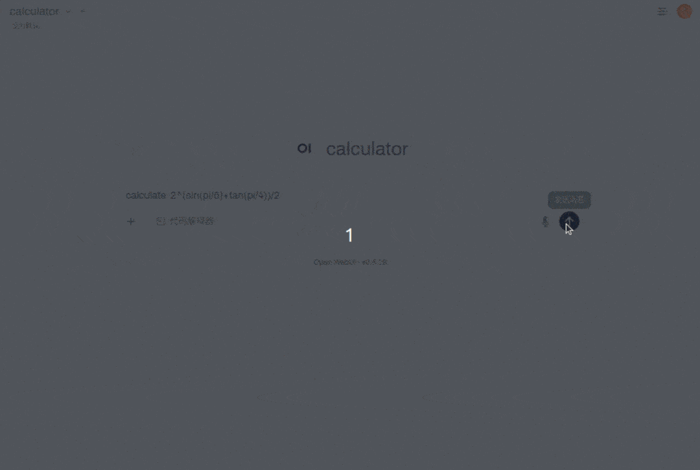

<p align="right">
  <a href="./README.cn.md">中文</a>
  ·
  <a href="./README.md">English</a>
</p>

# 🤖 Open Agent Platform

> 用自然语言描述你的目标，AI 智能体自动完成剩下的工作。



---

## ✨ 这是什么？

这是一个 **智能体平台**。你只需用自然语言描述你的目标，系统会自动：

1. 🧠 **理解意图** — 识别你的需求
2. 🔀 **任务分解** — 按领域流程拆解步骤
3. 👷 **多智能体协作** — 主编排智能体（Orchestrator）调度专业子智能体（Subagents）分别执行
4. 💬 **人机协作** — 编排计划与最终结果等关键节点弹出交互卡片，等你反馈后继续

整个流程模拟了 AI 多智能体协作与人机交互（HITL）工作模式。

### 📖 一个具体示例

当你发送 `"(1+2)/3*4"`，系统内部会发生以下步骤：

1. **Orchestrator 解析意图** — 识别为混合运算表达式，含括号和加减乘除
2. **编排计划确认（HITL）** — 展示运算顺序（用 a/b/c 等中间变量，不含预计算结果），确认后再执行
3. **按优先级归约** — 按已确认计划依次委派子智能体：
  - `add_agent`：`1+2` → 中间结果 `a`
  - `divide_agent`：`a/3` → 中间结果 `b`
  - `multiply_agent`：`b*4` → 最终结果
4. **最终结果确认（HITL）** — 展示完整逐步过程与最终结果，确认后再保存
5. **保存输出** — 选择工作目录并保存 `result.md`

整个过程中 SSE 流式输出实时展示 Orchestrator 的思考过程和子智能体的执行进度。

---

## 🎯 它能做什么？

平台本身是**业务无关的** — 通过替换 **`agents/`** 目录接入不同领域：


| Agent              | 描述                                                                                      |
| ------------------ | ------------------------------------------------------------------------------------------------ |
| 📋 **Calculator（默认）** | AI 科学计算器 — 编排层 HITL（计划确认 + 结果确认），子智能体仅执行工具（四则、幂、指数、对数、三角函数） |
| 🔧 **你的 Agent**   | 在 `agents/` 中编写 `manifest.yaml` + skills，即可接入任意领域 |


---

## 🚀 快速开始

### 前置条件

- **Node.js 22+**
- **DeepSeek API Key**

### 安装与启动

```bash
# 1. 安装依赖
npm install

# 2. 配置 API Key
cp .env.example .env
# 编辑 .env，填入你的 LLM_API_KEY

# 3. 启动服务
npm start
```

服务启动在 `http://localhost:8888`，提供 OpenAI 兼容 API。

### 验证服务

```bash
# 健康检查
curl http://localhost:8888/health

# 查看模型列表
curl http://localhost:8888/v1/models
```

### 🔧 环境变量说明


| 变量               | 默认值                        | 说明                             |
| ---------------- | -------------------------- | ------------------------------ |
| `LLM_API_KEY`    | —                          | DeepSeek API 密钥               |
| `MODEL_NAME`     | `deepseek-v4-flash`        | 使用的模型名称                        |
| `MODEL_BASE_URL` | `https://api.deepseek.com` | API 地址                          |
| `API_PORT`       | `8888`                     | 服务监听端口                         |
| `DEBUG_STREAM`   | `false`                    | 为 `1`/`true` 时将 SSE 输出 tee 到 `debug/{sessionId}.md` |
| `DEBUG_STREAM_DIR` | `debug/`（项目根下）       | DEBUG tee 输出目录                   |


### 本地 Markdown 预览调试（不依赖 OpenWebUI）

1. 在 `.env` 中设置 `DEBUG_STREAM=1`（可选 `DEBUG_STREAM_DIR`）。
2. 启动服务并发送 chat 请求（`curl` 或任意 SSE 客户端）。
3. 终端会打印 `Debug markdown: .../{sessionId}.md`；在编辑器中打开该文件并预览 markdown。

压测脚本会强制 `DEBUG_STREAM=0`，不会写入 `debug/`。

## 🧩 Agent 定义

平台核心与业务逻辑完全分离。部署的 agent 在 `agents/` 中声明式定义：

```
agents/
├── manifest.yaml    # Agent 清单：编排器、子智能体、工具、技能
├── skills/          # 各智能体的技能指令（SKILL.md）+ 脚本
└── tools/           # Agent 专属工具工厂（index.ts）
```

要部署不同的 agent，替换 `agents/` 目录内容并重启即可 — 无需改代码或环境变量。

默认 `agents/` 目录包含 AI 计算器 demo，可作为参考，或直接问我 😄

---

## 🔌 API

### 端点一览


| 端点                                       | 说明                         |
| ---------------------------------------- | -------------------------- |
| `GET /health`                            | 健康检查                       |
| `GET /v1/models`                         | 获取可用模型列表                   |
| `POST /v1/chat/completions`              | 对话（SSE 流式），支持中断自动恢复        |
| `GET /v1/sessions/:sessionId/live/:path` | 获取会话图片（MJPEG 实时流 + 静态 PNG） |
| `GET /v1/fs/list?path=...&dirs_only=...` | 文件系统浏览（供前端文件选择器使用）         |


### 调用示例

#### 健康检查

```bash
curl http://localhost:8888/health
```

响应：

```json
{
  "status": "healthy",
  "service": "<agent display_name>",
  "version": "v1.0",
  "active_streams": 0
}
```

#### 查看模型列表

```bash
curl http://localhost:8888/v1/models
```

响应：

```json
{
  "object": "list",
  "data": [
    {
      "id": "<agent model_id>",
      "object": "model",
      "created": 1700000000,
      "owned_by": "Open Agent Platform"
    }
  ]
}
```

> 模型 ID 由 `agents/manifest.yaml` 中的 `model_id` 决定。例如默认 AI 计算器 agent 返回 `calculator`。

---

## 📦 项目结构

```
├── src/             # 平台核心代码
│   ├── web_server.ts   # Fastify 入口，SSE 流式输出
│   ├── config.ts       # 配置管理
│   ├── agents/         # 智能体运行（runner、SSE 格式化）
│   ├── core/           # 核心框架（Agent 工厂、清单加载、会话管理、HITL 工具）
│   └── infra/          # 基础设施（SSE 流管理、LangGraph 检查点）
│
├── agents/          # Agent 定义（manifest + skills + tools）
│
├── frontend/        # 前端组件（nginx 注入到 OpenWebUI）
├── nginx/           # 反向代理配置
├── .env.example     # 环境变量模板
└── package.json
```

---

## 🛠 技术栈

- **Agent 框架**：deepagents
- **LLM**：DeepSeek V4，通过 `langchain_openai.ChatOpenAI` 接入，默认模型 `deepseek-v4-flash`
- **Web 服务**：Fastify（TypeScript）
- **流式输出**：SSE（Server-Sent Events）+ MJPEG（实时图片流）
- **运行时**：Node.js 22+
- **HITL**：`interrupt()` / `Command(resume=...)` 模式

---

## 💻 接入 OpenWebUI

本平台与 OpenWebUI 深度集成，提供 **HITL 交互卡片**、**文件路径选择器**、**动态图片渲染**、**会话管理**等能力。通过 nginx 将 OpenWebUI 页面和本平台后端统一代理，并注入前端 JS 将 HITL 代码块渲染为可交互组件。

> 📖 完整部署步骤（conda 环境、nginx 配置、会话身份 HTTP 头）见 **[docs/openwebui-integration.cn.md](docs/openwebui-integration.cn.md)**

---

## 📄 许可

MIT